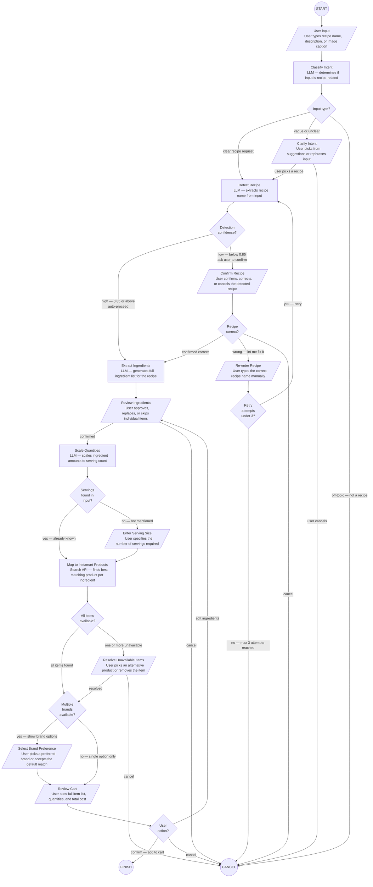

# hello-langchain

To install dependencies:

```bash
bun install
```

To run:

```bash
bun start
```

This project was created using `bun init` in bun v1.3.14. [Bun](https://bun.com) is a fast all-in-one JavaScript runtime.



THE EXTRA DIMENSIONS YOU NEED TO CAPTURE
Beyond just the recipe name, your pipeline needs to resolve five dimensions before ingredient extraction makes sense.
DIMENSION 1 — Variant
Which specific version of this recipe does the user want. For dosa: plain, masala, rava, Mysore masala, etc. This is the most important dimension because it determines the core ingredient list.
DIMENSION 2 — Experience Level
Is this person cooking this dish for the first time or have they made it before. A first-time dosa maker needs simpler instructions and may benefit from the rava variant over the fermented batter variant simply because it is achievable the same day.
DIMENSION 3 — Time Availability
Do they want to cook this today or are they planning ahead. Fermented dosa batter needs overnight prep. If the user says "I want to make dosa tonight", the LLM should flag this and either suggest rava dosa or ask if they already have fermented batter ready.
DIMENSION 4 — Accompaniments
Does the user want ingredients only for the dosa itself, or also for sambar, coconut chutney, or other traditional sides. This can double the ingredient list.
DIMENSION 5 — Dietary and Substitution Constraints
Vegan users cannot use ghee. Some users may be allergic to urad dal. A North Indian unfamiliar with South Indian cooking may not be able to find certain ingredients locally and may need substitutions.

* recipeName: Dosa
* variant: null — must resolve before proceeding
* filling: null — must resolve before proceeding
* accompaniments: [] — optional, defaults to none
* timeConstraint: tonight — inferred from user input
* fermentationPossible: false — inferred from timeConstraint
* recommendedVariant: Rava Dosa — system suggestion based on timeConstraint
* servings: null — must resolve before proceeding
* dietaryConstraints: [] — defaults to none
* substituteNeeded: false
